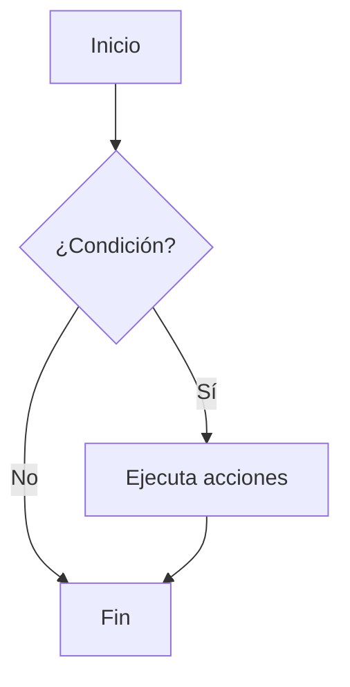
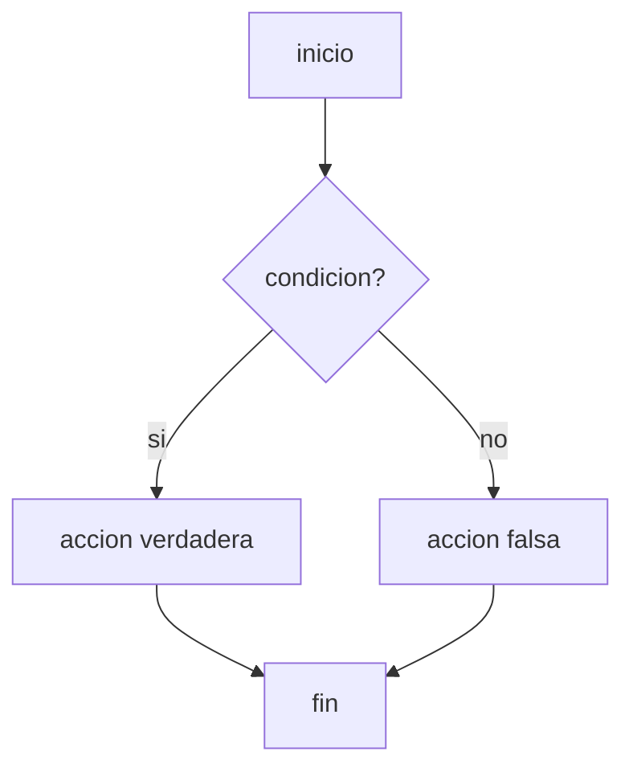
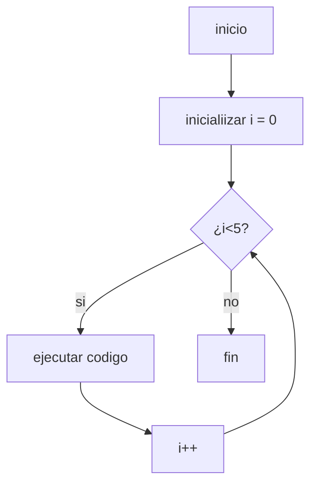
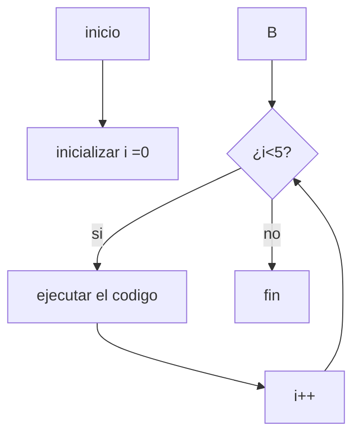
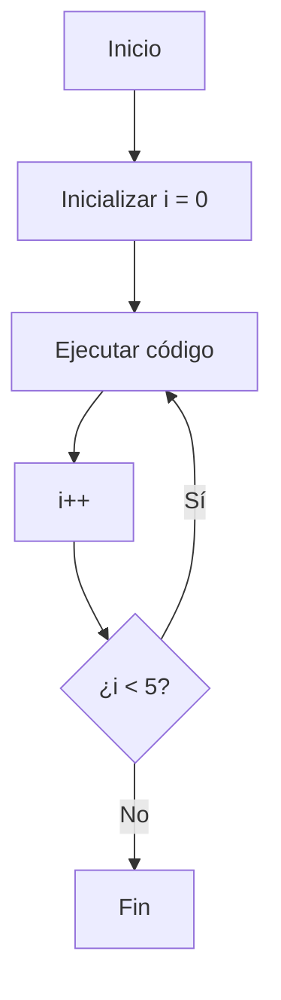
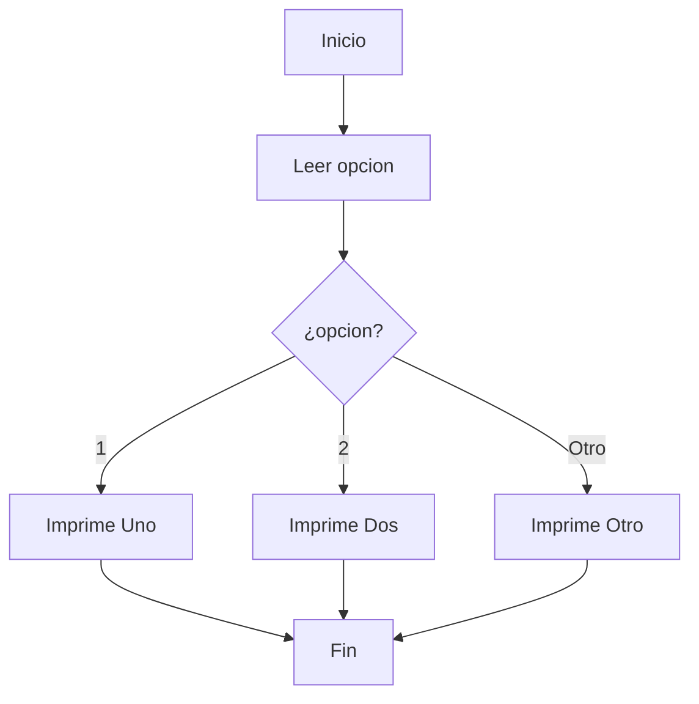

# Comandos para programar

## Flujogramas

### Formas de los flujogramas

- inico/fin =>cuadrado con esquinas circulares
- entrada/salida => paralelogramo
- proceso => rectangulo
- descision  => rombo
  
## Que es un "trash"?

Es una prueba de escritorio la cual se hace de manera manual (NO VIRTUAL) en el cual se pureba las situaciones y flujos del programa antes de iniciar a codificar para que no haya errores

---

## Que son las estructuras de control

tenemos varias estrucuturas de control en java como por ejemplo

### Comandos

- **if** = para dar una condicion

```java
  if (condicion) {
    //  aqui pones tus acciones
}
```



- **if - else**=aqui das acciones si es verdadero o si es falso le das otra condicion
  
```java
if (condicion) {
  //acciones si es verdadero
}
else{
  //acciones si es que es falso
}
```



- **FOR ciclo controlado** = es es para realizar un ciclo para que se vuelva a repetir una accion determinada

```java
for (int i = 0; i < 5; i++) {
    System.out.println(i);
}
```



- **WHILE**= repite un bloque de codigo mientras se cumpla la condcion dada.Osea mientras una condicion sea verdadera se sigue repitiendo

```java
int i=0;
while (i<5){
  System.out.println(i);
  i++;
}
```


-**do-while**=Sirve para repetir un bloque de código al menos una vez, y luego seguir repitiéndolo mientras la condición sea verdadera.Osea le dices ejecuta primero,pregunta despues.

```java
int i=0;
do{
  system.out.println(i);
  i++;
} while (i<5);
```



-**switch**?=sirve para tomar decisiones según el valor de una variable.osea le esta diciendo "si la variable vale esto haz esto, si vale aquello haz esto otro".

```java
switch (opcion){
  case 1:
    System.out.println("UNO");
    break;
  case 2:
    System.out.println("DOS");
    break;
  case 3:
    System.out.println("TRES");
    break;
  default:
    System.out.println("OTRO");
}
```


